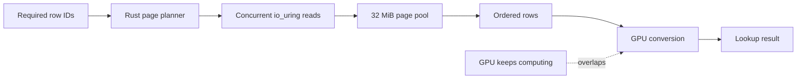

# sglang-ssd-stream

## Free 48 GB of RAM. Keep the speed.

An SSD streaming extension for [SGLang](https://github.com/sgl-project/sglang).
It runs Qwen3.8 Flash-Next without keeping its 48 GB lookup table in RAM. The
required data is loaded from SSD while the GPU is already working, preserving
the model's speed and leaving that memory available for context, cache, and
everything else on the machine.

The model and extension are packaged to work together:

- **Model:**
  [`garnermccloud/Qwen3.8-Flash-Next-NVFP4-SSD-Stream`](https://huggingface.co/garnermccloud/Qwen3.8-Flash-Next-NVFP4-SSD-Stream)
- **Server:** SGLang's OpenAI-compatible API
- **Model features:** NVFP4, native MTP, tools, images, and long context
- **Extra fixed memory for the 48 GB table:** about 64 MiB

## v0.3.0 runtime update

v0.3.0 packages 17 runtime modules, including two required compatibility
interfaces, in a hardware-selected, private SGLang
runtime view. The base SGLang installation is untouched, and model weights
are unchanged. On the RTX PRO 6000 Blackwell (96 GB), the default now enables
adaptive four/eight-token MTP, corrected sparse-index packing, ReplaySSM,
shared scratch/capture-stream resources, and early draft-head initialization.
Strict acceptance thresholds remain 1, SSM remains FP32, and KV remains FP8.
The default context is still 131,072 tokens. DGX Spark and portable-profile
arguments are unchanged.

Clean Ubuntu 24.04 installation and full-model checks passed on the RTX PRO
6000: SSD GPU smoke, five GPU packing tests, 12 functional checks including
tools, images, reasoning, and retrieval at 120,081 and 255,681 prompt tokens.
Both x86_64 and aarch64 wheels passed 65 CPU tests each; this is not aarch64
hardware acceptance. The 131K run recorded 30 window switches in each direction
and CUDA-graph replay for all 275 logged decode batches.

### Measured v0.3.0 default profile

Compared with `--no-rtx-optimizations`, using the same prepared model, GPU,
131,072-token context, strict acceptance, and 1,024-token completions:

| Workload | Fixed-four tok/s | Default tok/s | Median change |
| --- | ---: | ---: | ---: |
| List | 148.40 | 151.71 | +2.23% |
| Prose | 166.52 | 155.89 | -6.39% |
| Code | 208.78 | 217.59 | +4.22% |
| Reasoning | 134.02 | 136.59 | +1.92% |

**The results are mixed, not a universal speedup: prose regressed in this
sample.** Each arm/workload has six measured requests, excluding warmups.
Outputs varied, and these small synthetic samples are not a general quality
evaluation. The final control ran in a separate supervised pause after a
connection interruption. [Measurements, validation results, and artifact identity](benchmarks/results/rtx-pro-6000-v0.3.0.json)
include the complete protocol; [the client](benchmarks/validate_rtx.py) and
fixed input token IDs are included. Historical results below use a different
runtime and are not v0.3.0 default-profile results.

## Start serving

Use Linux with one NVIDIA GPU, a local SSD, and a standard C++ compiler. The
first launch downloads the prepared model, so allow about 140 GiB of disk
space. Installation creates a user-owned environment with the tested upstream
SGLang commit, matching NVIDIA and FlashInfer packages, and the SSD Stream
plugin. It does not alter the NVIDIA driver, system CUDA, system Python, or
operating-system packages. The native SSD reader is prebuilt, so no Rust
toolchain is required.

```bash
curl -LsSf https://raw.githubusercontent.com/garnermccloud/sglang-ssd-stream/main/install.sh | sh
~/.local/bin/sglang-ssd-stream serve
```

That starts an OpenAI-compatible API at `http://127.0.0.1:30000/v1`. Hardware
detection selects the validated 131K-context RTX PRO 6000 profile,
the experimental 262K-context DGX Spark profile, or a
conservative CPU-offload profile for smaller Linux x86_64 GPUs. The model stays pinned to the downloaded
revision until you choose to update it. SGLang compiles a few GPU-specific
kernels on first launch with one build job, then reuses its cache. Existing
system CUDA installations and additional SGLang settings are left alone.

```bash
curl -s http://127.0.0.1:30000/v1/chat/completions \
  -H 'Content-Type: application/json' \
  -d '{
    "model": "Qwen3.8-Flash-Next-NVFP4-SSD-Stream",
    "messages": [{"role": "user", "content": "Reply with: SSD Stream works"}],
    "max_tokens": 32
  }'
```

Common overrides remain available:

```bash
sglang-ssd-stream serve \
  --host 0.0.0.0 \
  --port 7778 \
  --api-key "$API_KEY" \
  --context 131072
```

For rollback or comparison, opt out of the RTX ports and use the old fixed-four
runtime:

```bash
sglang-ssd-stream serve --no-rtx-optimizations
```

`sglang-ssd-stream serve --context 262144` is a tested explicit RTX override;
it passed retrieval with a 255,681-token prompt and does not change the
131,072-token default.

Pass additional SGLang arguments after `--`:

```bash
sglang-ssd-stream serve -- --log-level info
```

## Updates

Software and model updates are separate and explicit. Rerun the installer to
update the isolated SGLang and plugin environment:

```bash
curl -LsSf https://raw.githubusercontent.com/garnermccloud/sglang-ssd-stream/main/install.sh | sh
~/.local/bin/sglang-ssd-stream serve
```

The v0.3.0 installer is version-bound to the 0.3.0 wheel. It builds and checks
a new virtual environment at its permanent path, then atomically promotes the
launcher. Previous environments are preserved; an installation failure leaves
the old launcher in place. A standard C++ compiler is still required.

No model update is needed for v0.3.0. To explicitly update the model separately,
run `sglang-ssd-stream update-model`. It downloads and validates the new
prepared snapshot before making it active. Existing model files are not deleted
automatically, so a changed or withdrawn upstream model cannot erase the
revision already on disk.

## Historical measured performance

### September 2026 RTX PRO optimization bundle

The [qualified adaptive-MTP source bundle](optimizations/rtx-pro-6000-20260909/README.md)
publishes the exact runtime changes deployed on September 9, with file hashes,
before/after patches, and 48 measured timing records. In a matched code-generation
workload, median throughput rose from **238.76 to 282.12 tok/s (+18.16%)**.
List, prose, and reasoning changes were +6.01%, +3.71%, and +0.38%; this is not a
universal speedup or an agent-quality claim. Model weights did not change.

This versioned source overlay targets a separate historical SGLang/SSD runtime.
That production runtime also used FRSpec with a 65,536-entry vocabulary,
draft-head NVFP4, and `lowm`; these are not in the v0.3.0 installer. v0.3.0
enables the ported runtime by default on the RTX PRO 6000, but does not
reproduce that entire production setup. **282.12 tok/s and +18.16% are historical
bundle results, not claims for the new default.** Its matched results are not
directly comparable with the earlier SSD-versus-RAM measurements below.

### Earlier RTX PRO 6000 Blackwell SSD-versus-RAM results

Matched tests on an RTX PRO 6000 Blackwell used Qwen3.8 Flash-Next NVFP4,
native MTP, CUDA graphs, and a 1,024-token completion:

| RTX PRO 6000 result | Value |
| --- | ---: |
| GPU memory | 96 GB |
| Normal lookup-table RAM | 47.68 GiB |
| SSD Stream working RAM | About 64 MiB |
| RAM returned | About 47.6 GiB |
| Normal RAM-loaded speed | 148.5-156.2 tok/s |
| SSD Stream speed | **164.7 tok/s** |

The 164.7 tok/s run is not a claim that SSD is faster than RAM. Speculative
acceptance varies with generated text. It demonstrates the important result:
the SSD work can be hidden well enough that the lookup table is no longer the
decode bottleneck. Requests dominated by new, random lookup rows measured
126-137 tok/s.

The earlier accepted RTX PRO 6000 configuration also passed (these are not
v0.3.0 acceptance results):

- native MTP and CUDA graph capture/replay;
- structured tool calls with changing arguments;
- unrelated image requests;
- an 80,011-token retrieval request;
- 120 alternating text, tool, and image requests;
- restart reuse with the Ubuntu VM running;
- no swap, OOM, restart, or host-memory growth.

### DGX Spark (experimental)

| DGX Spark result | Value |
| --- | ---: |
| Unified memory | 128 GB |
| Normal lookup-table memory | 47.68 GiB |
| SSD Stream working memory | About 64 MiB |
| Unified memory returned | About 47.6 GiB |
| Normal RAM-loaded speed | Pending hardware run |
| SSD Stream speed | Pending hardware run |

The Linux aarch64 wheel and automatic GB10 profile are included. It pins
[SGLang's SM121 QSA implementation](https://github.com/sgl-project/sglang/pull/36845)
and starts with 262K context, BF16 KV, FP32 model state, native MTP 3/1/4,
decode CUDA graphs, and one request at a time. Upstream validated that shape on
one DGX Spark with NVFP4 weights, the FP8 table on NVMe, long-context retrieval,
structured tools, sequential requests, and concurrency. SSD Stream's complete
Spark hardware acceptance and performance run is still pending, so the profile
is experimental rather than validated.

### Smaller NVIDIA GPUs (experimental)

RTX 3090, 4090, and 5090-class systems can run the same prepared NVFP4 model by
keeping part of the ordinary model weights in system RAM. SSD Stream still
serves the separate 47.68 GiB lookup table directly from SSD.

The launcher detects a smaller NVIDIA GPU, selects the compatible SGLang kernel,
and starts with a 16K context. It keeps the non-MoE core on the GPU and uses
SGLang's grouped offloader for every large expert block, prefetching one block
at a time.

| GPU memory | Example GPUs | Host memory target |
| ---: | --- | ---: |
| 32 GB | RTX 5090 | 128 GB |
| 24 GB | RTX 3090, RTX 4090 | 128 GB |

Use the normal command:

```bash
sglang-ssd-stream serve
```

The portable profile requires Linux x86_64, at least 24 GB of GPU memory,
compute capability 8.0 or newer, and about 80 GiB of available host memory at
startup. It disables MTP and CUDA graphs because expert weights move across
PCIe for every token, so it will be much slower than the full-GPU RTX PRO
profile. The same grouped path produced exact text and structured tool calls in
a partial-offload hardware simulation; complete 24 and 32 GB acceptance and
performance measurements remain pending.

## How it works

Qwen3.8 Flash-Next includes a 47.68 GiB predictive lookup embedding (PLE)
table. Each token needs only 16 rows from it, and those row addresses are known
before the model reaches the block that consumes them. SSD Stream starts the
reads early and overlaps them with the GPU computation immediately before that
block.

The native reader requests exact 4 KiB pages instead of triggering large mmap
readahead windows:

1. Copy the required row IDs asynchronously into pinned host memory.
2. Deduplicate the filesystem pages touched by those rows.
3. Read the pages concurrently through Rust and `io_uring`.
4. Restore duplicate rows in their original order.
5. Convert FP8 or BF16 staging data on a separate CUDA stream.
6. Synchronize only if the SSD work outlasts the overlapping GPU computation.



There is no multi-gigabyte private row cache. The reader owns a 32 MiB
registered page pool and two 16 MiB pinned staging buffers. Linux may retain
frequently used pages in reclaimable filesystem cache.

## Supported configuration

| Component | Status |
| --- | --- |
| Prepared model | `garnermccloud/Qwen3.8-Flash-Next-NVFP4-SSD-Stream` |
| SGLang on RTX PRO 6000 | Upstream Flash-Next source with [QSA FP8 KV support](https://github.com/sgl-project/sglang/pull/36644), pinned to commit `3df8e1e7dbc5807696622afe2929b6c33c185ca3` |
| SGLang on DGX Spark | Upstream Flash-Next source with the [SM121 QSA kernel](https://github.com/sgl-project/sglang/pull/36845), pinned to commit `0a79825b7baa3e2aafd54e89097a5aba83d00b4e` |
| Linux x86_64 / RTX PRO 6000 | v0.3.0 clean-install functional checks passed at 131K and explicit 262K; performance is workload-dependent |
| Linux aarch64 / DGX Spark | Experimental profile; hardware acceptance pending |
| Linux x86_64 / SM80+ with CPU offload | Experimental; 24 and 32 GB hardware acceptance pending |
| Table storage | FP8 and BF16 |
| Tensor parallelism | Supported by the reader and adapter |

The extension is for SGLang; it is not an official SGLang component. It pins
the integration to a tested SGLang revision and verifies the source files it
hooks before starting.

## Development

Release wheels include the native reader. Rust is only needed to change or
build it:

```bash
git clone https://github.com/garnermccloud/sglang-ssd-stream.git
cd sglang-ssd-stream
curl -LsSf https://astral.sh/uv/install.sh | sh
curl --proto '=https' --tlsv1.2 -sSf https://sh.rustup.rs | sh
source "$HOME/.cargo/env"
MATURIN_PEP517_ARGS="--compatibility manylinux_2_28" uv build --wheel
```

The Rust extension owns only the read hot path. Python retains the SGLang
plugin, model adapter, CUDA events, pinned staging tensors, Triton conversion,
graph replay integration, and tensor-parallel reduction.

## Credits

Built on [SGLang](https://github.com/sgl-project/sglang),
[Qwen3.8 Flash-Next](https://huggingface.co/Qwen/Qwen3.8-Flash-Next), and the
[RadixArk NVFP4 checkpoint](https://huggingface.co/RadixArk/Qwen3.8-Flash-Next-NVFP4).

The extension is Apache-2.0 licensed. Model weights retain their own license
and terms.
